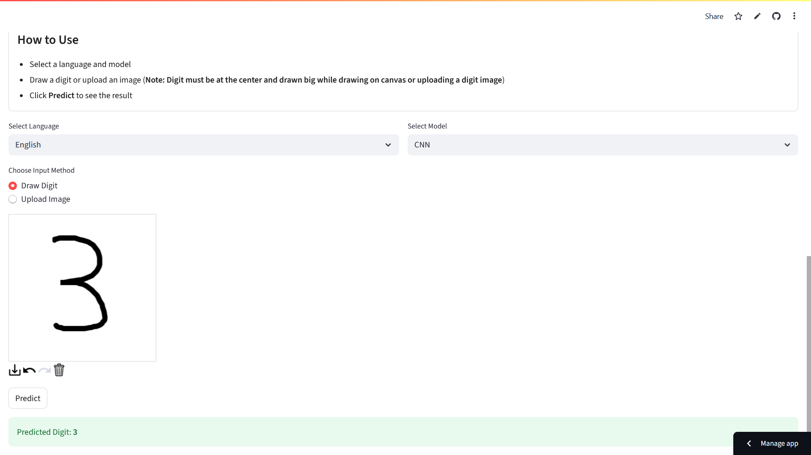

# 🖊️ Multi-Language Handwritten Digit Recognition Using Deep Learning

This project is a multilingual handwritten digit recognition system capable of classifying digits written in English, Hindi, and Kannada.
It leverages Convolutional Neural Networks (CNNs), Artificial Neural Networks (ANNs), and Random Forest (RF) classifiers.
The models are deployed in an interactive Streamlit web application, where users can either draw digits on a canvas or upload digit images for real-time predictions.

## 📌 Key Highlights

Supports three languages: English (MNIST), Hindi (Devanagari), Kannada
Implements 9 models (3 per language: CNN, ANN, RF)
Interactive Streamlit web interface for digit recognition

Two input options:
✏️ Draw a digit
🖼️ Upload a digit image
Real-time predictions with dynamic preprocessing based on the chosen model

📊 Models Implemented
| Model   | Description                                                               | Accuracy |
| ------- | ------------------------------------------------------------------------- | -------- |
| **CNN** | High-performing deep learning model leveraging spatial feature extraction | 96–99%   |
| **ANN** | Lightweight deep learning model with fully connected layers               | 90–94%   |
| **RF**  | Classical ML model using decision tree ensembles                          | 85–88%   |

## 📂 Datasets Used

English (MNIST) – Standard 28×28 grayscale digit dataset
Hindi (Devanagari) – MNIST-like dataset adapted for Hindi digits
Kannada – CSV-based dataset containing 28×28 grayscale pixel values

## ⚙️ Technologies used

## Language: 
Python 3.12

## Libraries:
Deep Learning: TensorFlow, Keras
Machine Learning: scikit-learn, joblib
Visualization: matplotlib, seaborn
UI & Deployment: Streamlit, streamlit-drawable-canvas
Data Handling: NumPy, Pandas
Image Processing: PIL
Tools: Jupyter Notebook, Google Drive (for model hosting), GitHub

## 🌐 Features of the Web App
 🔤 Language selection: English, Hindi, Kannada
 🧠 Model selection: CNN, ANN, RF

## 🖊️ Input options:
Draw digits directly on a canvas
Upload a digit image
⚡ Real-time inference with visual output display
🛡️ Robust error handling for invalid inputs

## 📸 Sample Demo
You can try it out by drawing on the canvas or uploading a digit image:

## 🚧 Challenges Encountered
Inconsistent dataset formats across different languages
Variability in free-hand drawn inputs
File size restrictions for uploading CNN .h5 models
Designing preprocessing pipelines tailored to each model type

## 📚 References  

- [TensorFlow Documentation](https://www.tensorflow.org/)  
- [Keras Documentation](https://keras.io/)  
- [scikit-learn](https://scikit-learn.org/)  
- [MNIST Dataset](http://yann.lecun.com/exdb/mnist/)  
- [Streamlit Docs](https://docs.streamlit.io/)  

